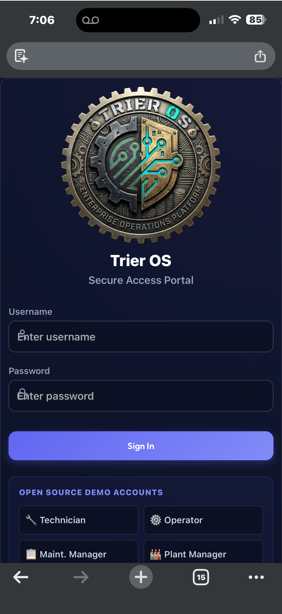
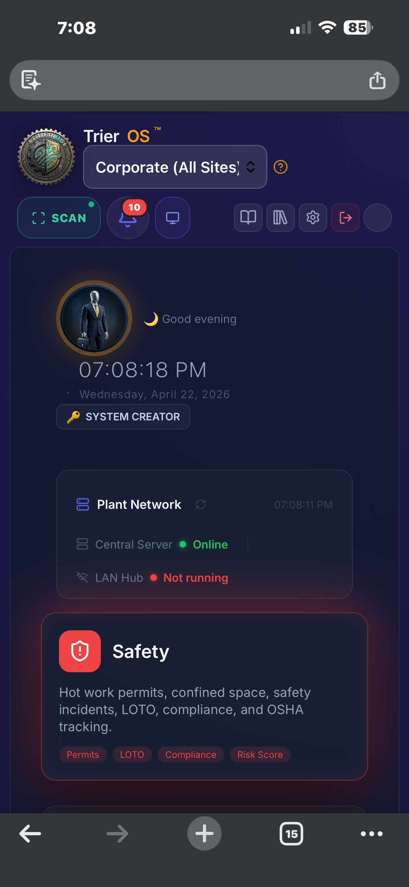
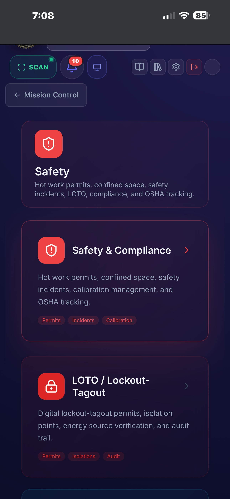
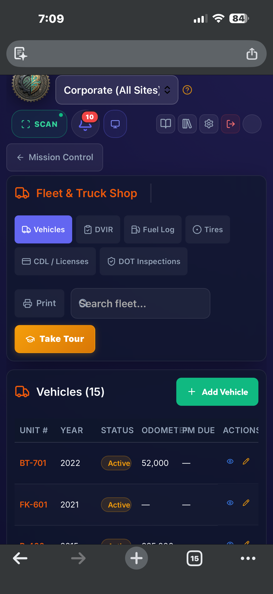
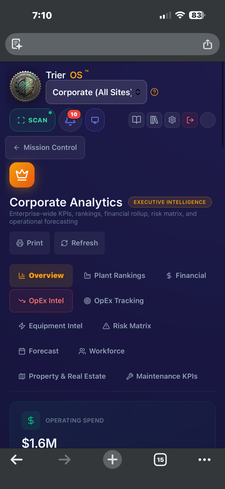
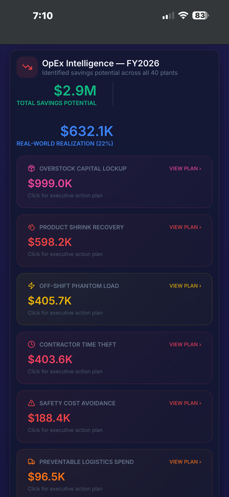
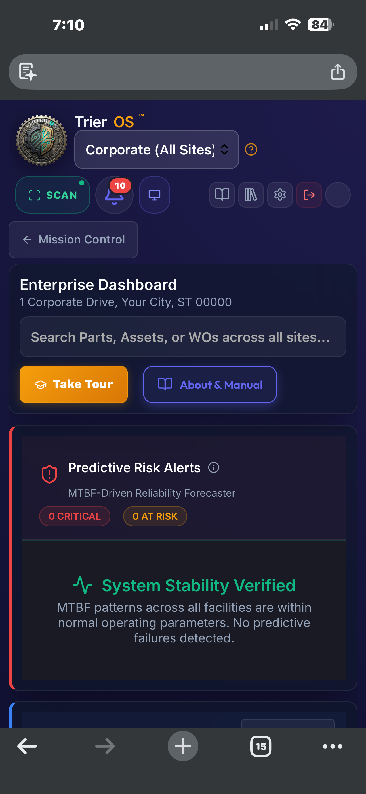
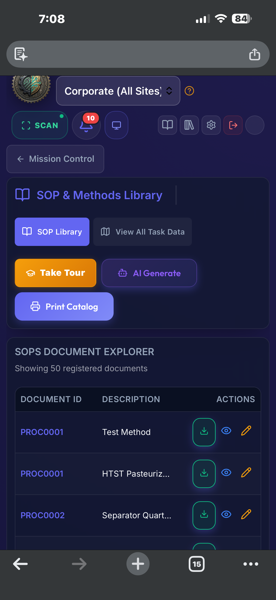

Read this in other languages: English | Español | Français | Deutsch | 中文 | Português | 日本語 | 한국어 | العربية | हिन्दी | Türkçe |

<div align="center">
  

  # Trier OS

  **Scan a machine → know what's happening → do the work → prove it.**

  Trier OS is an offline-first industrial operations platform built for real plant floors.

  [](https://github.com/DougTrier/trier-os/releases/tag/v3.6.1)
  [](https://react.dev/)
  [](https://nodejs.org/)
  [](https://sqlite.org/)
  [](https://cesium.com/)
  [](./playwright-reports/)

  [Features](#-the-advanced-engines) •
  [Installation](#-installation--quick-start) •
  [Architecture](#-zero-obfuscation-architecture) •
  [Security](./docs/SECURITY_CONTROLS.md) •
  [Integrations](./docs/INTEGRATIONS.md) •
  [ERP Guide](./docs/ERP_INTEGRATION_GUIDE.md) •
  [Why Trier OS](./docs/WHY_TRIER_OS.md) •
  [Pilot Guide](./docs/PILOT_GUIDE.md) •
  [5-Min Demo](./docs/DEMO_SCRIPT.md) •
  [Threat Model](./docs/THREAT_MODEL.md) •
  [Docs](./docs/ARCHITECTURE.md)

  ---

  *If this project creates value, please star the repo — it helps unlock funding to continue development.*
</div>

---

## ✅ Current Verified State

| | |
|---|---|
| **Release** | v3.6.1 |
| **Invariant Report** | PASS — all invariants (`/api/invariants/report`) |
| **Playwright (Desktop Chrome)** | 858 passed, 16 skipped, 0 failed |
| **Playwright (Mobile — Zebra TC77)** | Batched runs, all batches PASS |
| **Last Verified** | 2026-04-26 |

> Verified via `GET /api/invariants/report` (requires auth) and full Playwright suite. 16 skipped tests are intentional: hardware-dependent, external-service, or data-conditional.

<details>
<summary>Sample invariant report output</summary>

```json
{
  "overallStatus": "PASS",
  "invariants": [
    {
      "id": "I-04",
      "name": "Scan ID processed exactly once",
      "status": "PASS",
      "assertion": { "type": "structural", "violations": 0 },
      "enforcement": "UNIQUE INDEX on ScanAuditLog.scanId — duplicate caught at DB layer, returns structured 200"
    },
    {
      "id": "I-05",
      "name": "One active scanner per session",
      "status": "PASS",
      "assertion": { "type": "structural", "violations": 0 },
      "enforcement": "window.trierActiveScannerInterceptor flag set on mount, cleared on unmount"
    }
  ]
}
```

</details>

---

## 👋 Start Here

> **New to Trier OS? Pick your path:**
>
> 1. **Run a plant or manage a maintenance team?** → [Read the Pilot Guide](./docs/PILOT_GUIDE.md) — plain language, no jargon
> 2. **Want to see it in action in 5 minutes?** → [Run the Demo Script](./docs/DEMO_SCRIPT.md)
> 3. **IT, OT, or security reviewer?** → [Read the Threat Model](./docs/THREAT_MODEL.md)
> 4. **Ready to install?** → [Download v3.6.1 from Releases](https://github.com/DougTrier/trier-os/releases/latest) — includes step-by-step PDF

---

## ⚡ What Makes Trier OS Different

Most systems work like this:

```
Scan → open record → navigate menus → decide what to do → act
```

Trier OS works like this:

```
Scan → system understands state → shows next action → one tap → tracked and auditable
```

No searching. No navigation. No guessing. No wasted motion.

| | Most CMMS / EAM tools | Trier OS |
|---|---|---|
| Scan result | Opens a record | Executes the next action |
| Network dependency | Required to operate | Optional — works fully offline |
| Typing required | Yes | Zero keystrokes on the floor |
| Missed close-outs | Silent ghost records | Auto-flagged for supervisor review |
| Data location | Cloud or shared server | Per-plant SQLite, fully on-premise |
| Testing philosophy | Tested for success | Tested for failure |

---

## 🏭 Built for the Real World

Plant floors are not perfect environments:

- Wi-Fi drops mid-shift
- Technicians can't stop to type
- Scans misfire or come in fast
- Work happens faster than records

Trier OS is designed for that reality:

- **Offline-first** — IndexedDB queue captures every scan; drains automatically on reconnect
- **Idempotent operations** — duplicate scans never create duplicate records
- **Failure-safe workflows** — nothing is lost, everything is tracked and auditable
- **Per-plant local databases** — one SQLite file per plant, zero cloud dependency
- **Zero-keystroke floor execution** — tap-only actions, no keyboard on the plant floor

---

## 🔁 Core Workflow

```
Scan asset → Start work → Add parts → Return unused parts → Close → Outcome recorded
```

- Start or continue work instantly from any scan
- Batch scan parts with no confirmation per scan
- Return unused parts directly back to stock
- Close work with full audit trail
- Time saved and downtime cost calculated automatically

---

## 📦 Offline Receiving (Zebra / Mobile)

Scan incoming parts with no Wi-Fi:

```
Scan → saved to device → synced when back online → unresolved items flagged for admin review
```

Clear states at all times:

| State | Meaning |
|---|---|
| Saved offline | Captured on device, not yet synced |
| In inventory | Synced and accepted |
| Needs review | Captured but not applied — awaiting admin |

---

## How it works on the plant floor

A technician walks up to a machine and scans it. The system identifies the asset, finds any open work order, and surfaces tap-only action buttons — no typing, no navigation. They start work, complete it, and close it out. The next scan on the same asset shows the correct state to every device in the plant instantly.

**If the server goes down or the network drops, nothing stops.** Every scan queues locally on the device. When connectivity returns, the queue drains automatically and the record is complete. Supervisors see which devices are live on the plant LAN and which scans are waiting to sync. Work orders left open by a missed close-out scan are flagged automatically for supervisor review — not silently left as ghost records.

This is what the system does on day one, before anyone configures an algorithm or reads a dashboard.

> **Not an ERP.** Trier OS handles plant operations, maintenance, safety, parts, assets, and execution intelligence. It does not replace financial general ledger, payroll, or accounting modules. It integrates with ERP systems (SAP, Oracle, and others) but runs independently of them.

---

## 🎬 Demo

[](https://www.youtube.com/watch?v=cOxjyI-GKOo)

## 📸 Screenshots

<div align="center">

| Mission Control | Assets & Machinery |
|---|---|
|  |  |

| Corporate Analytics | Floor Plans |
|---|---|
|  |  |


*Live Studio — Embedded Monaco IDE with deploy pipeline, blast-radius mapper, and deterministic simulation engine*

</div>

### 📱 Mobile (iPhone / iOS)

Real-device screenshots from an iPhone running Trier OS v3.6.1 over a plant LAN:

<div align="center">

| Login | Mission Control | Safety Portal | Fleet & Truck Shop |
|---|---|---|---|
|  |  |  |  |

| Corporate Analytics | OpEx Intelligence | Enterprise Dashboard | SOP Library |
|---|---|---|---|
|  |  |  |  |

</div>

> Full set of 14 iPhone screenshots: [`docs/mobile/`](./docs/mobile/)

---

## 📖 Overview

**For plant managers and supervisors:** Every work order, asset scan, safety permit, and inventory movement is tracked in real time. Supervisors see live operational state across all devices on the plant LAN. The system self-corrects missed actions and surfaces them for review rather than silently accumulating bad data.

**For IT and engineering teams:** Trier OS runs entirely on-premises — one SQLite database per plant, zero cloud dependency, full offline capability, and an embedded Monaco-based IDE for authorized in-app code modification. The architecture is documented to a 10% minimum contextual density standard across every logic file.

**For executives:** A corporate analytics layer aggregates KPIs, spend, OEE, and OpEx intelligence across every plant simultaneously — with 14 automated savings algorithms that identify hidden losses and generate phased action plans ranked by dollar value.

---

## 🤔 Is Trier OS for You?

**Strong fit:**

- **Poor or unreliable Wi-Fi on the plant floor** — technicians keep working; scans queue locally and sync when connectivity returns
- **Technicians on the floor, not at desks** — zero-keystroke scan-to-action; no menus, no navigation, no typing required
- **Multi-plant operations** — each plant gets its own isolated database; corporate analytics layer aggregates across all of them
- **Air-gapped or OT-network environments** — runs entirely disconnected from the internet; no cloud dependency, EDR-safe
- **Existing ERP you want better data flowing into** — Trier OS emits verified, idempotent operational events to any ERP endpoint
- **Teams that want the source code** — fully open source, MIT license, self-hostable in under 10 minutes

**Not the right fit (yet):**

- You need SOC2 Type II or ISO certification on the CMMS itself — controls are equivalent but no formal audit has been performed
- You need real-time bidirectional ERP financial sync — Trier OS is outbound-only by design
- You need a large partner ecosystem for implementation support — this is open source, not a managed service

---

## ✨ The Advanced Engines

- 🛠️ **The Live Studio Sandbox:** An embedded Monaco-based IDE allowing authorized "Creators" to write, sandbox, and hot-reload source code directly inside the production app. No external servers required.
- 🌌 **The Parallel Universe Engine:** Forget AI hallucinations. This deterministic simulation engine replays historical plant event logs against your sandboxed code changes, providing mathematical proof that a code change won't crash the factory floor.
- 📡 **Plant LAN Peer Sync:** A WebSocket hub embedded in each plant's local area network synchronizes all floor devices in real time — Zebra scanners, tablets, and workstations — with no internet required. Supervisors see live device presence counts.
- 🔄 **Offline Queue & Auto-Recovery:** Scans captured offline persist in a local IndexedDB queue. On reconnect, the queue drains automatically. If the session expires during an extended outage, the queue is preserved and drain resumes after re-auth — no scan is ever lost.
- 🤖 **Silent Auto-Close Engine:** An hourly server cron detects work segments left open by missed close-out scans, closes them with a `TimedOut` state, and flags the parent work order for supervisor review. Exempt holds (waiting-for-parts, locked-out) are never auto-closed.
- 🛡️ **Human Airgap Security:** The system mandates a hard security boundary. All AI-assistance is decoupled from the plant network and strictly human-mediated, avoiding liability nightmares.
- 🌍 **GIS Spatial Intelligence:** Fully integrated 3D spatial intelligence maps (powered by Cesium) to pinpoint hardware across corporate campuses.
- 📱 **Mobile Hardware Scanning:** Embedded WebRTC barcode scanning for real-time audit sweeps on iOS/Android or Zebra rugged devices.
- 🔒 **EDR-Safe Local Mode:** Runs entirely disconnected from the cloud using a self-contained `better-sqlite3` instance natively built for strictly firewalled Operational Technology (OT) networks.

---

## ⚙️ Installation & Quick Start

**Quickest path:** Download the [Windows installer and step-by-step PDF guide](https://github.com/DougTrier/trier-os/releases/latest) from the Releases page.

**From source** (developers, Mac/Linux, contributors):

### Requirements
- Node.js v22+
- Git

### Clone & Build
```bash
git clone https://github.com/DougTrier/trier-os.git
cd trier-os
npm install
cp .env.example .env   # Windows: copy .env.example .env
npm run seed           # creates databases with demo data
npm run dev:full       # starts API + UI
```

Open `http://localhost:5173` and log in with `ghost_admin` / `Trier3652!`

### Keeping Trier OS Updated
```bash
git pull origin main && npm install
```

---

### 🐧 Linux

```bash
git clone https://github.com/DougTrier/trier-os.git
cd trier-os
npm install
npm run dev:full
```

Open `http://localhost:5173`.

**Desktop installer (Electron):** The pre-built `.exe` / `.msi` installers in [Releases](https://github.com/DougTrier/trier-os/releases) are Windows-only. To compile a native Linux desktop app:

```bash
sudo apt-get install -y libopenjp2-tools rpm fakeroot
npm run electron:build
```

> **Note:** electron-builder requires matching native modules for your distro. Running via `npm run dev:full` is the recommended Linux path and is fully functional.

---

## 🧪 Tested for Reality

Before every release, Trier OS is tested across:

- Full workflow traversal on desktop and Zebra mobile
- Offline / online transitions and queue replay
- Failure paths, edge cases, and race conditions
- RBAC boundaries and API surface hardening
- High-speed scan input and dedup window enforcement

**Most systems are tested for success. Trier OS is tested for failure.**

Current suite: **1463 / 1482 passing — 0 failures** (v3.6.1, verified 2026-04-26)
19 skipped: hardware-dependent tests (run on target device), optional external services (Edge Mesh, Gatekeeper audit), and data-conditional tests that skip gracefully when prerequisite records don't exist.

> **Mobile runs are batched** (<75 tests per batch) to avoid known upstream WebSocket connection exhaustion on Zebra TC77 emulation. Each batch runs independently and must pass. Combined results are equivalent to a full suite run — batching reflects engineering judgment, not instability.

---

## 🔐 Security & Funding

### Security

Because this software operates physical manufacturing assets, vulnerabilities are handled with extreme caution. **Do not** report exploits in public GitHub issues.

- httpOnly cookie authentication with separate hub token secret
- Parameterized queries only — no SQL interpolation
- plantId validated at every route boundary before DB access
- Production hardening via environment variables
- Live Studio disabled in production via `DISABLE_LIVE_STUDIO`
- Full threat model: [docs/THREAT_MODEL.md](./docs/THREAT_MODEL.md)

Please read [`SECURITY.md`](./SECURITY.md) for responsible disclosure protocols.

### Support the Project

Trier OS is completely free and open-source, always. If this software runs your facility, consider supporting ongoing development via the **Sponsor** button at the top of the repository.

---

## 🤝 Contributing

This is not a casual project. Code runs against live plant-floor systems.

- All tests run against a live instance — no database mocking
- UI changes require screenshots in the PR
- No unhandled errors or silent failures
- Minimum 10% contextual documentation density enforced
- Every file must carry the Trier OS Architecture Header

See [`CONTRIBUTING.md`](./CONTRIBUTING.md) for full standards.

**New to this codebase? Start here — in this order:**

1. [`docs/SYSTEM_TOPOLOGY.md`](./docs/SYSTEM_TOPOLOGY.md) — full system map and three concrete request traces
2. [`CLAUDE.md`](./CLAUDE.md) — development standards; overrides all other defaults
3. [`server/routes/scan.js`](./server/routes/scan.js) — the core scan state machine; most critical file in the system
4. [`docs/ARCHITECTURE_INVARIANTS.md`](./docs/ARCHITECTURE_INVARIANTS.md) — what correctness means here and how it's enforced
5. [`docs/CONTRIBUTOR_MAP.md`](./docs/CONTRIBUTOR_MAP.md) — governance lifecycle: how changes move from idea to production

---

## 🧭 Philosophy

> *Software should match how work actually happens — not force people to adapt to it.*

Most systems help you track work.  
**Trier OS helps you do the work faster — and prove it.**

---

## 📜 Legal & License

Released under the **MIT License**. Free to use, modify, and deploy within your organization.
