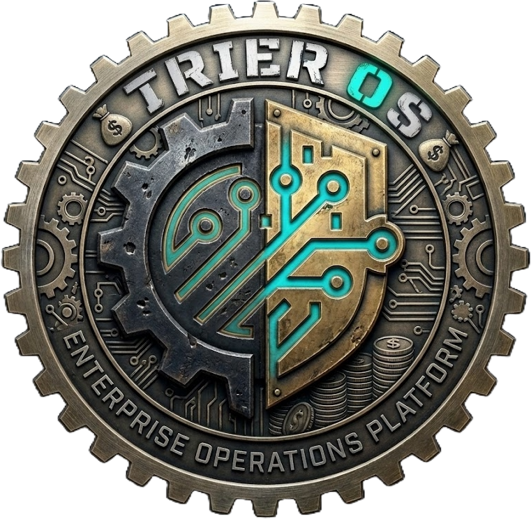
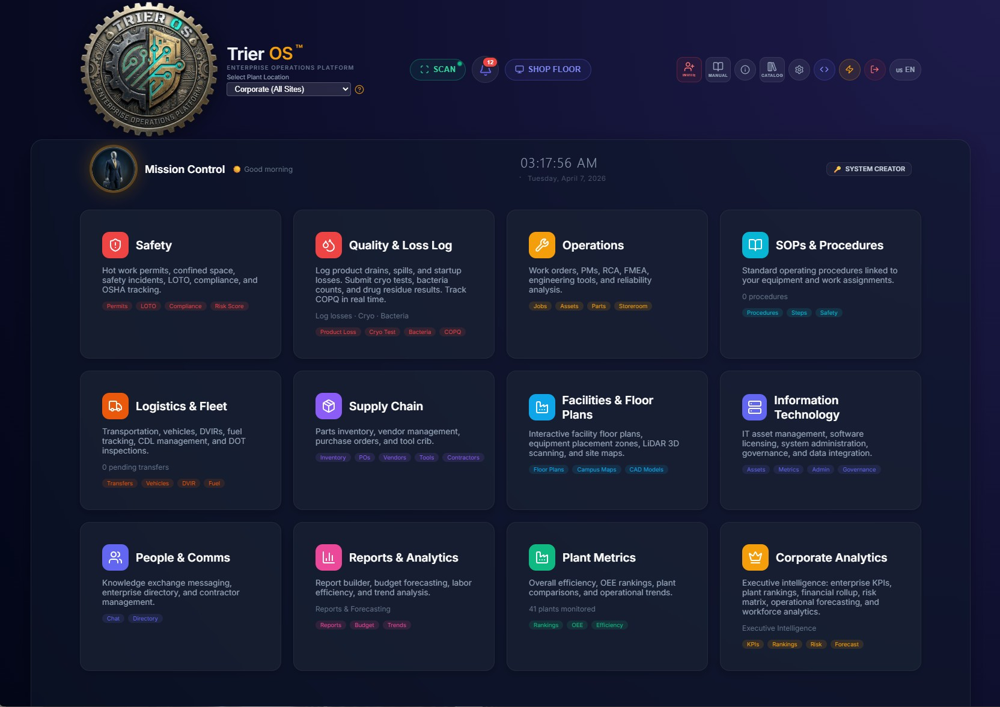
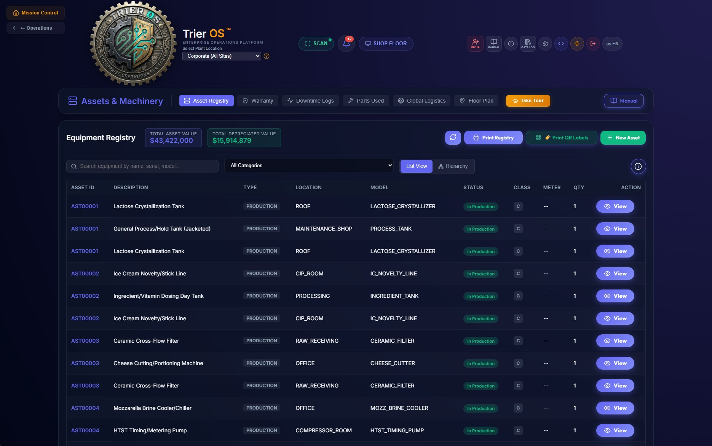
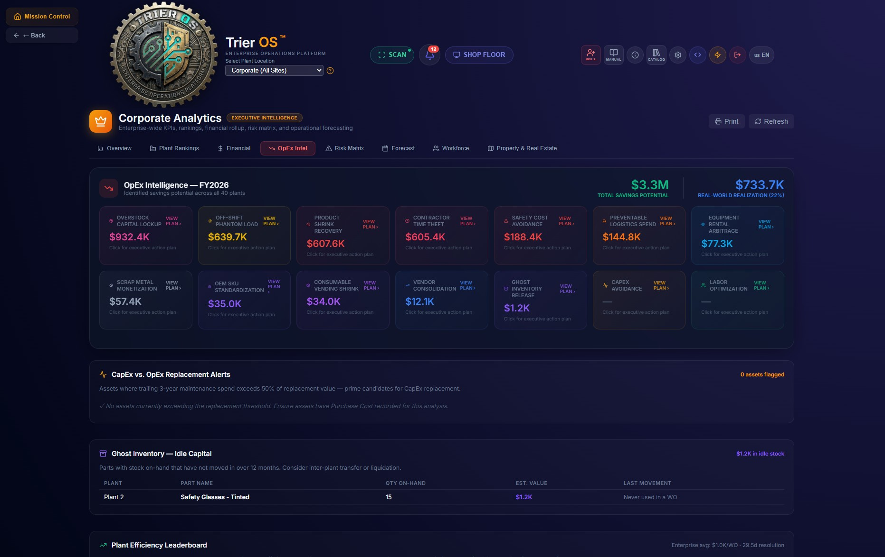
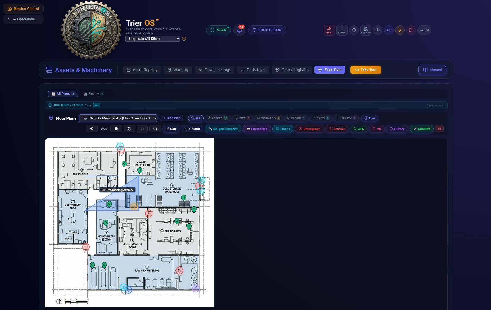
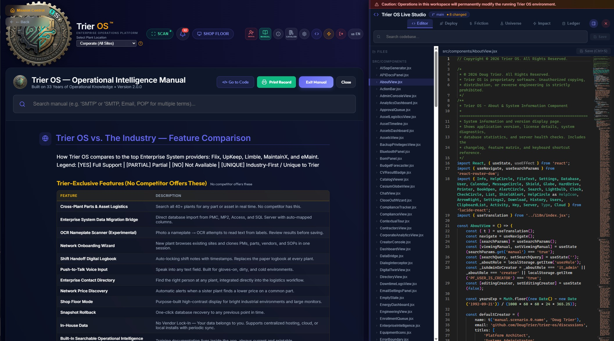

Read this in other languages: English | Español | Français | Deutsch | 中文 | Português | 日本語 | 한국어 | العربية | हिन्दी | Türkçe |

<div align="center">
  

  # Trier OS
  
  **Industrial Operations Platform — Built for the Plant Floor**

  [](https://react.dev/)
  [](https://nodejs.org/)
  [](https://sqlite.org/)
  [](https://cesium.com/)

  [Features](#sparkles-the-advanced-engines) •
  [Installation](#gear-installation--quick-start) •
  [Architecture](#triangular_ruler-zero-obfuscation-architecture) •
  [Security](#shield-security--funding) •
  [Demo Data](./docs/DEMO_DATA.md) •
  [Quick Facts](./docs/QUICK_FACTS.md) •
  [Docs](./docs/ARCHITECTURE.md)

  ---

  *If this project creates value, please star the repo — it helps unlock funding to continue development.*
</div>

---

## How it works on the plant floor

A technician walks up to a machine and scans it. The system identifies the asset, finds any open work order, and surfaces tap-only action buttons — no typing, no navigation. They start work, complete it, and close it out. The next scan on the same asset shows the correct state to every device in the plant instantly.

**If the server goes down or the network drops, nothing stops.** Every scan queues locally on the device. When connectivity returns, the queue drains automatically and the record is complete. Supervisors see which devices are live on the plant LAN and which scans are waiting to sync. Work orders that were left open by a missed close-out scan are flagged automatically for supervisor review rather than left as ghost records.

This is what the system does on day one, before anyone configures an algorithm or reads a dashboard.

---

## 🎬 Demo

[](https://www.youtube.com/watch?v=cOxjyI-GKOo)

## 📸 Screenshots

<div align="center">

| Mission Control | Assets & Machinery |
|---|---|
|  |  |

| Corporate Analytics | Floor Plans |
|---|---|
|  |  |



*Live Studio — Embedded Monaco IDE with deploy pipeline, blast-radius mapper, and deterministic simulation engine*

</div>

---

## 📖 Overview

**Trier OS** is an enterprise-grade, full-stack Plant Operations platform built to run heavy industrial facilities. It is not a lightweight SaaS widget — it is a complete, local-first operating system for the plant floor, designed to keep working when the network doesn't.

**For plant managers and supervisors:** Every work order, asset scan, safety permit, and inventory movement is tracked in real time. Supervisors see live operational state across all devices on the plant LAN. The system self-corrects missed actions and surfaces them for review rather than silently accumulating bad data.

**For IT and engineering teams:** Trier OS runs entirely on-premises — one SQLite database per plant, zero cloud dependency, full offline capability, and an embedded Monaco-based IDE for authorized in-app code modification. The architecture is documented to a 10% minimum contextual density standard across every logic file.

**For executives:** A corporate analytics layer aggregates KPIs, spend, OEE, and OpEx intelligence across every plant simultaneously — with 14 automated savings algorithms that identify hidden losses and generate phased action plans ranked by dollar value.

---

## :sparkles: The Advanced Engines

- 🛠️ **The Live Studio Sandbox:** An embedded Monaco-based IDE allowing authorized "Creators" to write, sandbox, and hot-reload source code directly inside the production app. No external servers required.
- 🌌 **The Parallel Universe Engine:** Forget AI hallucinations. This deterministic simulation engine replays historical plant event logs against your sandboxed code changes, providing mathematical proof that a code change won't crash the factory floor.
- 📡 **Plant LAN Peer Sync:** A WebSocket hub embedded in each plant's local area network synchronizes all floor devices in real time — Zebra scanners, tablets, and workstations — with no internet required. Supervisors see live device presence counts.
- 🔄 **Offline Queue & Auto-Recovery:** Scans captured offline persist in a local IndexedDB queue. On reconnect, the queue drains automatically. If the session expires during an extended outage, the queue is preserved and drain resumes after re-auth — no scan is ever lost.
- 🤖 **Silent Auto-Close Engine:** An hourly server cron detects work segments left open by missed close-out scans, closes them with a `TimedOut` state, and flags the parent work order for supervisor review. Exempt holds (waiting-for-parts, locked-out) are never auto-closed.
- 🛡️ **Human Airgap Security:** The system mandates a hard security boundary. All AI-assistance is decoupled from the plant network and strictly human-mediated, avoiding liability nightmares.
- 🌍 **GIS Spatial Intelligence:** Fully integrated 3D spatial intelligence maps (powered by Cesium) to pinpoint hardware across corporate campuses.
- 📱 **Mobile Hardware Scanning:** Embedded WebRTC barcode scanning for real-time audit sweeps on iOS/Android or Zebra rugged devices.
- 🔒 **EDR-Safe Local Mode:** Runs entirely disconnected from the cloud using a self-contained `better-sqlite3` instance natively built for strictly firewalled Operational Technology (OT) networks.

---

## :gear: Installation & Quick Start

Because Trier OS requires its architectural source to power the Live Studio, you must clone the raw repository.

### 1. Requirements
*   Node.js (v22+)
*   Git

### 2. Clone & Build
```bash
git clone https://github.com/DougTrier/trier-os.git
cd trier-os
npm install
```

### 3. Start the Environment
Boot up the API and UI in the concurrent development environment.
```bash
npm run dev:full
```
The application will automatically ignite at `http://localhost:5173`.

### Keeping Trier OS Updated
```bash
git pull origin main
```

---

## :triangular_ruler: Zero Obfuscation Architecture

Trier OS is built on extreme contextual transparency. We enforce a hard **10% minimum Contextual Density Ratio** across 156,000+ lines of core application logic.

Every logic file contains the mandatory **Trier OS Architecture Header Pattern**, meaning over 16,600 lines of context documentation exist purely to bridge the gap between engineering scripts and physical Plant Floor Operations.

**Notice to Contributors:** Any pull request that drops the core contextual coverage below 100% will be rejected automatically. See `CONTRIBUTING.md` for our strict header templates.

---

## :shield: Security & Funding

### Security Protocols
Because this software operates physical manufacturing assets, we handle vulnerabilities with extreme caution. **Do not** report exploits in the public GitHub issues. Please read `SECURITY.md` for our responsible disclosure email protocols.

### Support the Project
Trier OS is completely free and open-source. If this software runs your warehouse or manufacturing facility, consider supporting our ongoing development!

Click the **Sponsor** button at the top of the repository to view our Funding Gateway (GitHub Sponsors, Open Collective for corporate B2B tax receipts, and Ko-Fi).

---

## 📜 Legal & License
Released openly under the **MIT License**. You are free to use, modify, and distribute this platform within your corporation.
