Read this in other languages: English | Español | Français | Deutsch | 中文 | Português | 日本語 | 한국어 | العربية | हिन्दी | Türkçe |

<div align="center">
  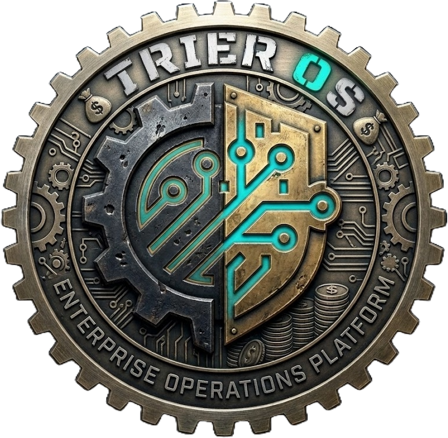

  # Trier OS

  **Scan a machine → know what's happening → do the work → prove it.**

  Trier OS is an offline-first industrial operations platform built for real plant floors.

  [](https://github.com/DougTrier/trier-os/releases)
  [](https://react.dev/)
  [](https://nodejs.org/)
  [](https://sqlite.org/)
  [](https://cesium.com/)
  [](./docs/SECURITY_MAINTENANCE_VALIDATION.md)

  [Features](#-the-advanced-engines) •
  [Installation](#-installation--quick-start) •
  [Architecture](#-zero-obfuscation-architecture) •
  [Security](./docs/SECURITY_CONTROLS.md) •
  [Integrations](./docs/INTEGRATIONS.md) •
  [ERP Guide](./docs/ERP_INTEGRATION_GUIDE.md) •
  [Why Trier OS](./docs/WHY_TRIER_OS.md) •
  [Pilot Guide](./docs/PILOT_GUIDE.md) •
  [5-Min Demo](./docs/DEMO_SCRIPT.md) •
  [Threat Model](./docs/THREAT_MODEL.md) •
  [Docs](./docs/ARCHITECTURE.md)

  ---

  *If this project creates value, please star the repo — it helps support continued maintenance.*
</div>

---

## ✅ Current Verified State

| Evidence | Result |
|---|---|
| **Version / status** | 3.7.2 — preservation and security maintenance; feature frozen |
| **Complete Playwright gate** | 1,151 instances, all 7 projects: 1,129 passed, 22 documented conditional skips, 0 failed, 0 not run; no retries or flaky results |
| **Backend and migration validation** | All 23 unit-test files, 56 migration starting states and 11 integration checks passed |
| **Installer preservation** | All 21 isolated lifecycle scenarios passed; accounts, passwords, roles, groups, memberships and permissions preserved |
| **Database validation** | SQLite integrity, foreign keys, IT orphan checks and application invariants passed; original development data unchanged |
| **Last verified** | 2026-09-17 (full run completed September 18 UTC) |

The complete run includes the preservation, reset, authentication, migration and corporate-view corrections. Conditional skips remain coverage gaps; browser emulation is separate from physical scanner/phone testing. [Detailed results and limits](./docs/SURGICAL_REMEDIATION_AUDIT.md).

Normal upgrades and reinstalls preserve initialized data. Destructive reset remains a separate, explicitly confirmed action with a verified backup. [Release notes](./docs/RELEASE_NOTES_3.7.2.md).

Trier OS is feature frozen. Work is limited to confirmed break/fix, security maintenance and necessary compatibility maintenance; stability is intentional. [Maintenance policy](./docs/MAINTENANCE.md).

---

## 👋 Start Here

> **New to Trier OS? Pick your path:**
>
> 1. **Run a plant or manage a maintenance team?** → [Read the Pilot Guide](./docs/PILOT_GUIDE.md) — plain language, no jargon
> 2. **Want to see it in action in 5 minutes?** → [Run the Demo Script](./docs/DEMO_SCRIPT.md)
> 3. **IT, OT, or security reviewer?** → [Read the Threat Model](./docs/THREAT_MODEL.md)
> 4. **Ready to install?** → [Download v3.7.2 from Releases](https://github.com/DougTrier/trier-os/releases/tag/v3.7.2) — includes step-by-step PDF

---

## ⚡ What Makes Trier OS Different

Most systems work like this:

```
Scan → open record → navigate menus → decide what to do → act
```

Trier OS works like this:

```
Scan → system understands state → shows next action → one tap → tracked and auditable
```

No searching. No navigation. No guessing. No wasted motion.

| | Most CMMS / EAM tools | Trier OS |
|---|---|---|
| Scan result | Opens a record | Executes the next action |
| Network dependency | Required to operate | Local scan/cache fallback; recovery depends on deployment |
| Typing required | Yes | Zero keystrokes on the floor |
| Missed close-outs | Silent ghost records | Auto-flagged for supervisor review |
| Data location | Cloud or shared server | Per-plant SQLite, fully on-premise |
| Testing philosophy | Tested for success | Tested for failure |

---

## 🏭 Built for the Real World

Plant floors are not perfect environments:

- Wi-Fi drops mid-shift
- Technicians can't stop to type
- Scans misfire or come in fast
- Work happens faster than records

Trier OS is designed for that reality:

- **Offline-first** — IndexedDB queues supported offline scan actions for replay on reconnect
- **Scan deduplication** — scan IDs and database uniqueness guards protect supported replay paths
- **Recovery-oriented workflows** — pending scans and review flags make incomplete work visible
- **Per-plant databases at corporate HQ** — one SQLite file per plant, no mandatory cloud service
- **Zero-keystroke floor execution** — tap-only actions, no keyboard on the plant floor

---

## 🔁 Core Workflow

```
Scan asset → Start work → Add parts → Return unused parts → Close → Outcome recorded
```

- Start or continue work instantly from any scan
- Batch scan parts with no confirmation per scan
- Return unused parts directly back to stock
- Close work with full audit trail
- Time saved and downtime cost calculated automatically

---

## 📦 Offline Receiving (Zebra / Mobile)

Scan incoming parts with no Wi-Fi:

```
Scan → saved to device → synced when back online → unresolved items flagged for admin review
```

Clear states at all times:

| State | Meaning |
|---|---|
| Saved offline | Captured on device, not yet synced |
| In inventory | Synced and accepted |
| Needs review | Captured but not applied — awaiting admin |

---

## How it works on the plant floor

A technician walks up to a machine and scans it. The system identifies the asset, finds any open work order, and surfaces tap-only action buttons — no typing, no navigation. They start work, complete it, and close it out. The next scan on the same asset shows the correct state to every device in the plant instantly.

**When connectivity drops, supported scan actions can queue locally.** Reconnect replay is designed to restore records; operators must confirm per-item acceptance and investigate pending or failed items. Physical outage/restart and every hub replay path have not been fully validated. Supervisors see which devices are live on the plant LAN and which scans are waiting to sync. Work orders left open by a missed close-out scan are flagged automatically for supervisor review — not silently left as ghost records.

This is what the system does on day one, before anyone configures an algorithm or reads a dashboard.

> **Not an ERP.** Trier OS handles plant operations, maintenance, safety, parts, assets, and execution intelligence. It does not replace financial general ledger, payroll, or accounting modules. It integrates with ERP systems (SAP, Oracle, and others) but runs independently of them.

---

## 🎬 Demo

[](https://www.youtube.com/watch?v=cOxjyI-GKOo)

## 📸 Screenshots

<div align="center">

| Mission Control | Assets & Machinery |
|---|---|
| 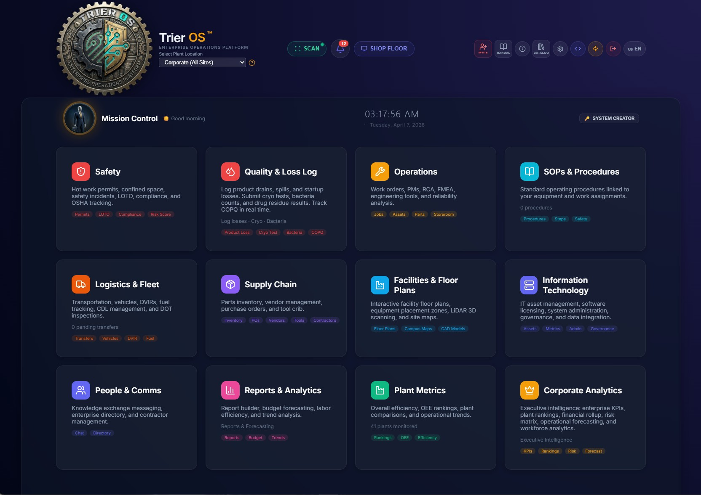 | 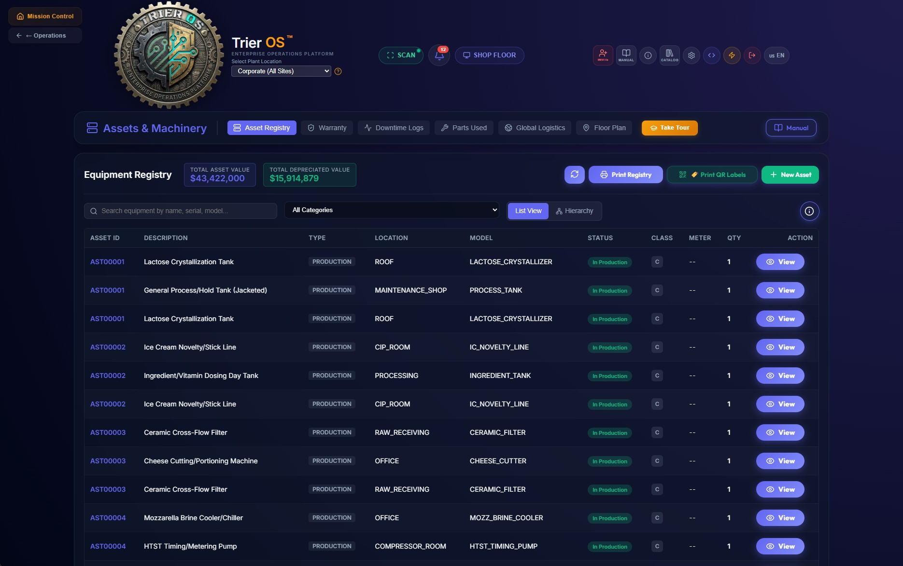 |

| Corporate Analytics | Floor Plans |
|---|---|
| 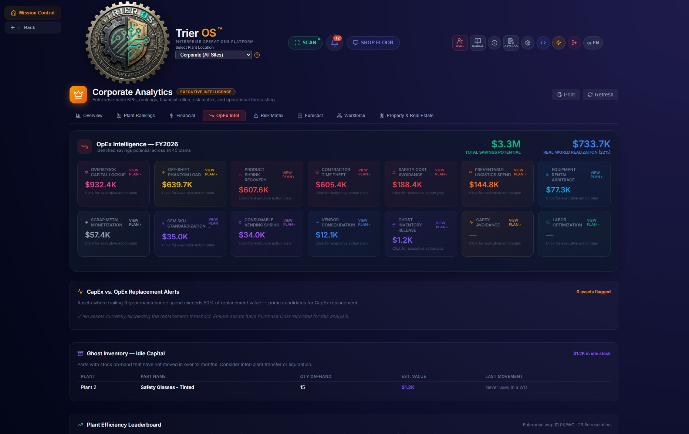 | 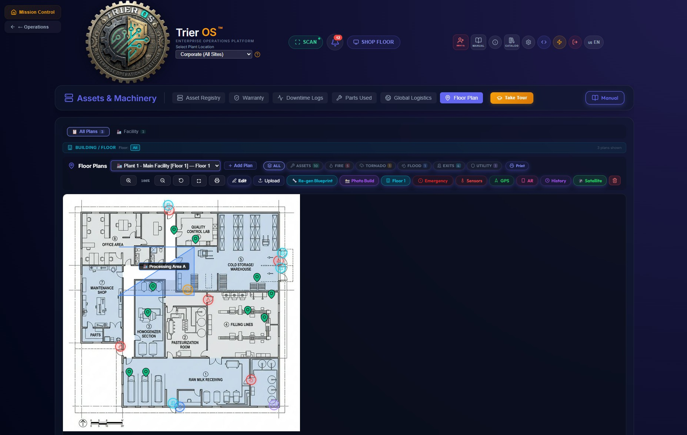 |

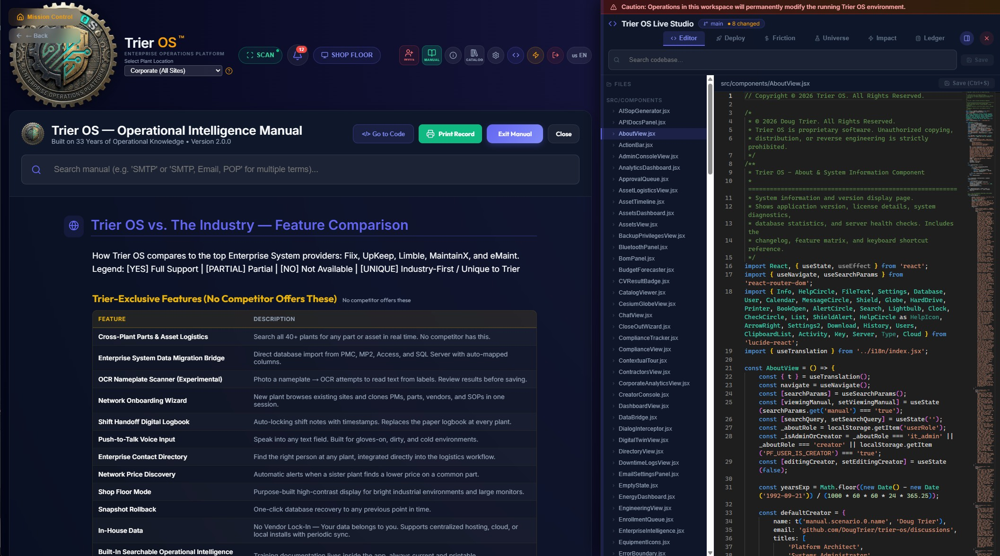

*Live Studio — Embedded Monaco IDE with deploy pipeline, blast-radius mapper, and deterministic simulation engine*

</div>

### 📱 Mobile (iPhone / iOS)

Real-device screenshots from an iPhone running Trier OS v3.7.1 over a plant LAN:

<div align="center">

| Login | Mission Control | Safety Portal | Fleet & Truck Shop |
|---|---|---|---|
| 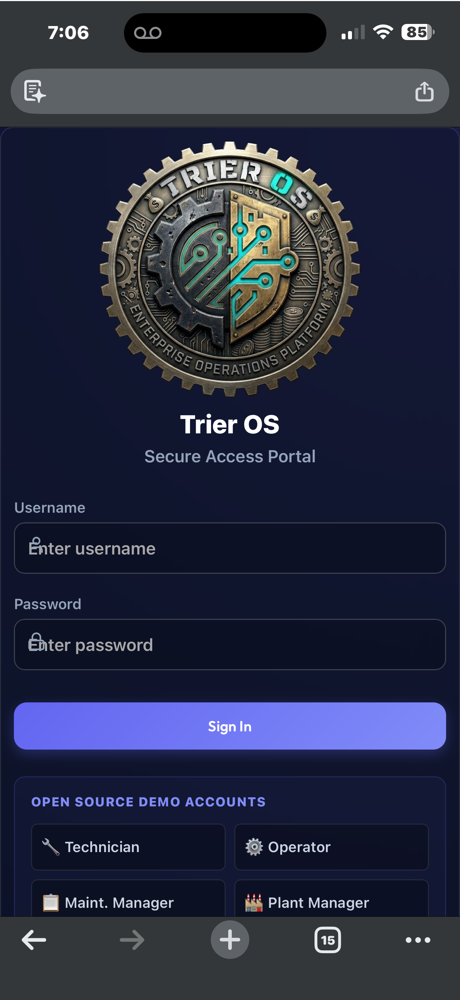 | 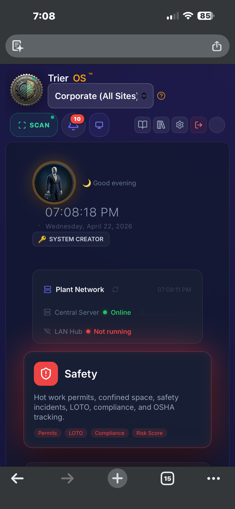 | 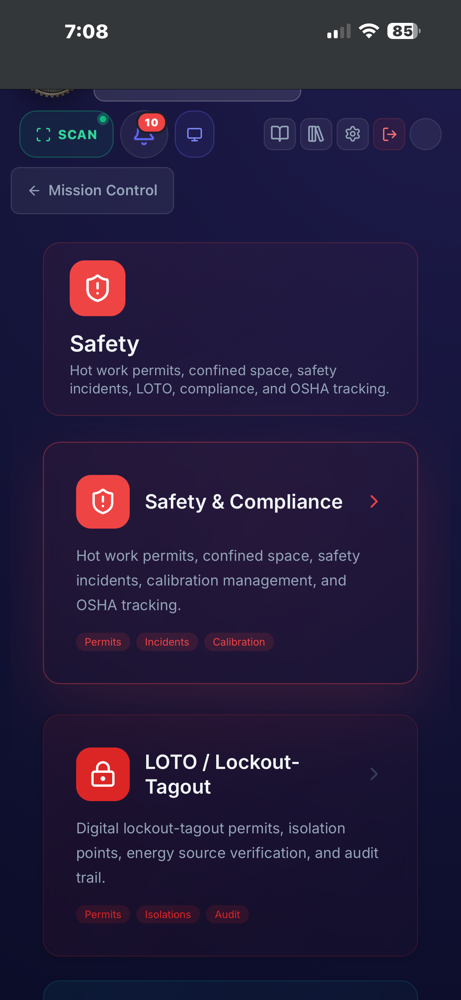 | 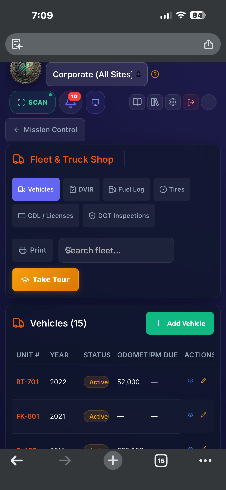 |

| Corporate Analytics | OpEx Intelligence | Enterprise Dashboard | SOP Library |
|---|---|---|---|
| 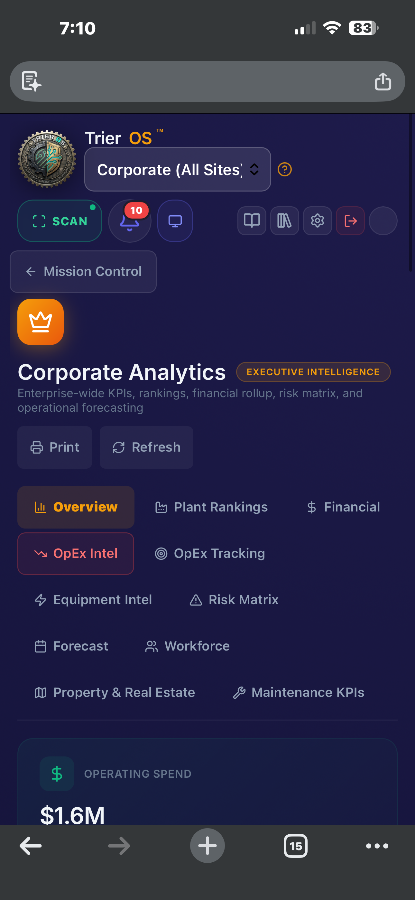 | 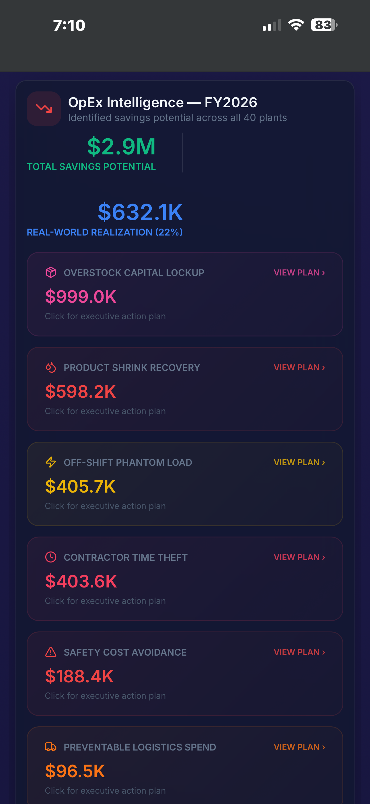 | 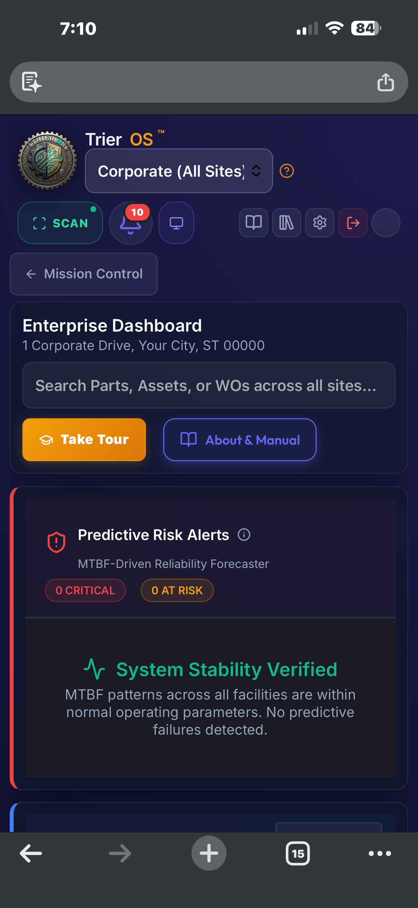 | 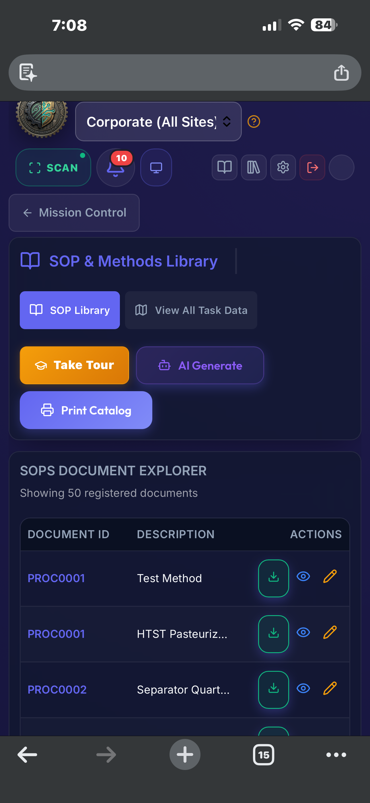 |

</div>

> Full set of 14 iPhone screenshots: [`docs/mobile/`](./docs/mobile/)

---

## 📖 Overview

**For plant managers and supervisors:** Every work order, asset scan, safety permit, and inventory movement is tracked in real time. Supervisors see live operational state across all devices on the plant LAN. The system self-corrects missed actions and surfaces them for review rather than silently accumulating bad data.

**For IT and engineering teams:** Trier OS runs entirely on-premises — one corporate instance holding a SQLite database per plant, local scan/cache fallback, and an optional Monaco-based development IDE that must be disabled in production. The architecture is documented to a 10% minimum contextual density standard across every logic file.

**For executives:** A corporate analytics layer aggregates KPIs, spend, OEE, and OpEx intelligence across every plant simultaneously — with 14 automated savings algorithms that identify hidden losses and generate phased action plans ranked by dollar value.

---

## 🤔 Is Trier OS for You?

**Strong fit:**

- **Poor or unreliable Wi-Fi on the plant floor** — technicians keep working; scans queue locally and sync when connectivity returns
- **Technicians on the floor, not at desks** — zero-keystroke scan-to-action; no menus, no navigation, no typing required
- **Multi-plant operations** — each plant gets its own isolated database; corporate analytics layer aggregates across all of them
- **Air-gapped or OT-network environments** — can operate without a mandatory cloud service; optional integrations need their configured network access
- **Existing ERP you want better data flowing into** — Trier OS emits verified, idempotent operational events to any ERP endpoint
- **Teams that want the source code** — fully open source, MIT license, self-hostable with documented deployment prerequisites

**Deployment limits:**

- You need SOC2 Type II or ISO certification on the CMMS itself — no formal certification or control-equivalence assessment has been performed
- You need real-time bidirectional ERP financial sync — Trier OS is outbound-only by design
- You need a large partner ecosystem for implementation support — this is open source, not a managed service

---

## ✨ The Advanced Engines

- 🛠️ **The Live Studio Sandbox:** An embedded Monaco-based IDE allowing authorized Creators to edit and simulate code in development environments. No external servers required. **Optional on source and ZIP installations; disable with `DISABLE_LIVE_STUDIO=true` in production.** The Electron launcher sets that flag for EXE/MSI use.
- 🌌 **The Parallel Universe Engine:** Forget AI hallucinations. This deterministic simulation engine replays historical plant event logs against your sandboxed code changes, providing evidence about the historical scenarios replayed, rather than proof of all future behavior.
- 📡 **Plant LAN Peer Sync:** A WebSocket hub embedded in each plant's local area network synchronizes all floor devices in real time — Zebra scanners, tablets, and workstations — with no internet required. Supervisors see live device presence counts.
- 🔄 **Offline Queue & Auto-Recovery:** Scans captured offline persist in a local IndexedDB queue. On reconnect, the queue drains automatically. If the session expires during an extended outage, the queue is preserved and drain is intended to resume after re-auth; recovery and acknowledgements still require deployment-specific validation.
- 🤖 **Silent Auto-Close Engine:** An hourly server cron detects work segments left open by missed close-out scans, closes them with a `TimedOut` state, and flags the parent work order for supervisor review. Exempt holds (waiting-for-parts, locked-out) are never auto-closed.
- 🛡️ **Human Airgap Security:** The system mandates a hard security boundary. All AI-assistance is decoupled from the plant network and strictly human-mediated, avoiding liability nightmares.
- 🌍 **GIS Spatial Intelligence:** Fully integrated 3D spatial intelligence maps (powered by Cesium) to pinpoint hardware across corporate campuses.
- 📱 **Mobile Hardware Scanning:** Embedded WebRTC barcode scanning for real-time audit sweeps on iOS/Android or Zebra rugged devices.
- 🔒 **Local Database Mode:** Runs entirely disconnected from the cloud using a self-contained `better-sqlite3` instance natively built for strictly firewalled Operational Technology (OT) networks.

---

## ⚙️ Installation & Quick Start

**Quickest path:** Download the [Windows installer and step-by-step PDF guide](https://github.com/DougTrier/trier-os/releases/latest) from the Releases page.

**From source** (developers, Mac/Linux, contributors):

### Requirements
- Node.js v22+
- Git

### Source development startup

```bash
git clone https://github.com/DougTrier/trier-os.git
cd trier-os
npm ci
cp .env.example .env
npm run dev:full
```

On Windows, use `Copy-Item .env.example .env` instead of `cp` if needed. Open `http://localhost:5173` for the Vite development UI. The API starts from `server/index.js`. Database initialization occurs through application startup and existing provisioning paths; `npm run seed` is **not** a database-seeding CLI.

For a fresh auth database, first boot creates the `creator` account and writes its random initial credentials to `data/first_login.txt` (or the resolved `DATA_DIR`). Change the password and securely remove that file. Existing creator credentials are not regenerated on every boot. The public `demo_*` accounts use `TrierDemo2026!` and are server-confined to `examples`; they are distinct from development-only ghost accounts. [Demo guide](./docs/DEMO_CREDENTIALS.md).

Phone camera/scanner access needs a trusted secure context: use `https://YOUR-SERVER-IP:1938` and a certificate trusted by the device. A development self-signed certificate may require device trust setup; merely dismissing a warning is not a guarantee that all browsers enable camera APIs.

### Corporate production deployment

Deploy one corporate instance at headquarters; all plants connect to it. HQ holds the per-plant databases. Optional LAN Hub/Electron fallback supports local scan state and cached reads. The existing Electron package starts an embedded server on its own host; it does not automatically become a thin client pointed at HQ. [Architecture and packaging distinction](./docs/ARCHITECTURE.md).

Build the frontend with `npm run build`. Provision production secrets and TLS as described in [SECURITY.md](./SECURITY.md), then start the configured corporate service:

```powershell
# Windows PowerShell, after provisioning .env / protected service environment
$env:NODE_ENV = 'production'
$env:DISABLE_LIVE_STUDIO = 'true'
npm run start:cluster
```

```bash
# Linux/macOS source server, after provisioning protected secrets
NODE_ENV=production DISABLE_LIVE_STUDIO=true npm run start:cluster
```

`npm run start:prod` exists but uses Windows cmd `set` syntax; it is not a portable Linux command. The configured Electron installer targets are Windows; native Linux/macOS installers are not established by this build configuration. Source-server use and optional external integrations require validation on the intended platform.

Before updating, preserve local changes, take a consistent secured backup, review the maintenance change and validate it in a separate deployment. Do not replace production data with bundled demo databases. [Deployment and rollback](./docs/p2/Deployment_and_Rollback.md).

---

## 🧪 Tested for Reality

The validation above covers live-instance browser workflows, role boundaries, scan behavior and security regressions. The seven configured projects comprise Desktop Chrome and six Mobile Chrome batches using a Pixel 5 emulation profile. They do not represent seven physical devices.

Some offline and hardware-scanner tests mock or intercept communication. They do not prove every real transport, power-loss, restart or paired-server recovery path. Runtime invariant reports must be read with their per-invariant coverage; an empty dataset can produce PASS without exercising behavior. [Testing details](./docs/SECURITY_MAINTENANCE_VALIDATION.md).

---

## 🔐 Security & Funding

### Security

Because this software operates physical manufacturing assets, vulnerabilities are handled with extreme caution. **Do not** report exploits in public GitHub issues.

- httpOnly cookie authentication with separate hub token secret
- Bound SQL values and validated dynamic identifiers are required by the security standards
- Validated request context for plant DB routing; demo isolation enforced server-side
- Production hardening via environment variables
- Live Studio disabled in production via `DISABLE_LIVE_STUDIO`
- Full threat model: [docs/THREAT_MODEL.md](./docs/THREAT_MODEL.md)

Please read [`SECURITY.md`](./SECURITY.md) for responsible disclosure protocols.

### Support the Project

Trier OS is completely free and open-source, always. If this software runs your facility, consider supporting ongoing maintenance via the **Sponsor** button at the top of the repository.

---

## 🤝 Contributing

This is not a casual project. Code runs against live plant-floor systems.

- All tests run against a live instance — no database mocking
- UI changes require screenshots in the PR
- No unhandled errors or silent failures
- Minimum 10% contextual documentation density enforced
- Every file must carry the Trier OS Architecture Header

See [`CONTRIBUTING.md`](./CONTRIBUTING.md) for full standards.

**New to this codebase? Start here — in this order:**

1. [`docs/SYSTEM_TOPOLOGY.md`](./docs/SYSTEM_TOPOLOGY.md) — full system map and three concrete request traces
2. [`CLAUDE.md`](./CLAUDE.md) — development standards; overrides all other defaults
3. [`server/routes/scan.js`](./server/routes/scan.js) — the core scan state machine; most critical file in the system
4. [`docs/ARCHITECTURE_INVARIANTS.md`](./docs/ARCHITECTURE_INVARIANTS.md) — what correctness means here and how it's enforced
5. [`docs/CONTRIBUTOR_MAP.md`](./docs/CONTRIBUTOR_MAP.md) — governance lifecycle: how changes move from idea to production

---

## 🧭 Philosophy

> *Software should match how work actually happens — not force people to adapt to it.*

Most systems help you track work.  
**Trier OS helps you do the work faster — and prove it.**

---

## 📜 Legal & License

Copyright © 2026 **Doug Trier**, owner of the original Trier OS source. The [MIT License](./LICENSE) permits use, copying, modification, distribution, sublicensing and sale subject to retaining its copyright and permission notices. This is not a public-domain dedication.

Trier OS™ branding identifies Doug Trier's project. Code licensing and branding rights are separate; see [TRADEMARKS.md](./TRADEMARKS.md).
