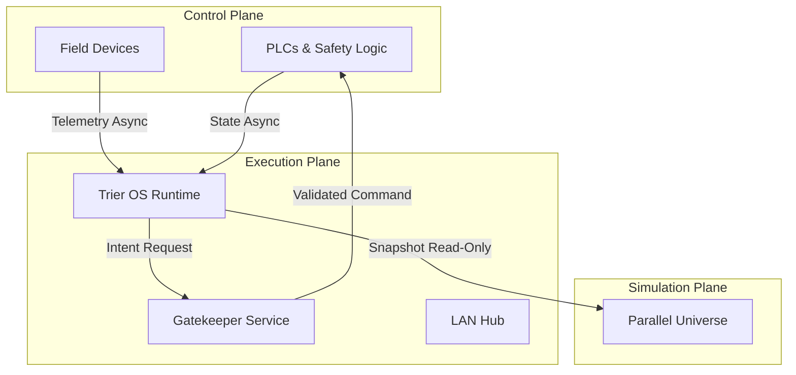

<!-- Copyright © 2026 Trier OS. All Rights Reserved. -->
# Trier OS: Failure Domain Isolation Architecture (v1)

## Context & Overview
This document defines the Failure Domain Isolation architecture required before any safety-critical plant deployment. It ensures that the Execution Plane (Trier OS) cannot physically or logically bring down the Control Plane (PLC/SCADA), and that simulations run entirely isolated from production.

## 3-Plane Architecture Model
The architecture is strictly divided into three isolated planes:

1. **Control Plane**
   - **Components:** PLCs, Safety PLCs, Variable Frequency Drives (VFDs), hard-wired interlocks.
   - **Boundary Rules:** 
     - Operates with ZERO runtime dependency on Trier OS.
     - If Trier OS goes completely offline, the Control Plane continues operating normally under local logic.
     - Accepts governed intents (write commands) *only* via the Gatekeeper service, never directly from edge clients.

2. **Execution Plane**
   - **Components:** Trier OS main runtime, LAN Hub, offline PWA clients, Gatekeeper.
   - **Boundary Rules:**
     - Reads telemetry asynchronously.
     - Issues governed intents to the Control Plane through Gatekeeper.
     - Runs the core scan state machine and manages work orders.

3. **Simulation Plane**
   - **Components:** Parallel Universe (sandbox), Time Machine replay engine.
   - **Boundary Rules:**
     - Has absolute zero write paths to production.
     - Clones production state (read-only snapshots) for deterministic forward simulation.

## Data Flow Diagram

## System States
Trier OS implements four distinct operational states. Note: A partial implementation already exists via `health.js` and the `degradedMode.js` middleware.

1. **Normal:** All systems online, bidirectional read/write path active.
2. **Degraded:** External integrations (ERP/Supply Chain) down, core execution continues.
3. **Advisory-Only:** Write paths physically disabled at the Gatekeeper. Trier OS provides read-only telemetry and recommendations.
4. **Isolated:** Trier OS completely severed from the plant network. Control Plane runs autonomously.

## Existing Isolation Infrastructure
While the 3-plane boundary enforcement will be built in future sprints, Trier OS currently has robust mechanisms for handling complete isolation:
- **LAN Hub (Port 1940):** An active WebSocket edge service that keeps device scan states alive if the corporate instance is unreachable. It maintains a local read-only subset of plant data and queues all work order scans to be securely replayed (`POST /api/scan/offline-sync`) upon reconnection.
- **HA Replication (`ha_sync.js`):** Pushes active ledger state to a secondary node to ensure failure recovery is deterministic and does not rely on local plant infrastructure surviving. 

## Implementation Roadmap (Future Sprints)
The following implementation tasks are planned for future sprints to fully realize this architecture. Do not execute these against the current monolith without a staged migration plan:
- **[IMPLEMENTED]** Split core services into independent runtimes.
- **[IMPLEMENTED]** Introduce message bus with backpressure (NATS or equivalent).
- **[IMPLEMENTED]** Add circuit breakers on all external connectors.
- **[IMPLEMENTED]** Execute Failure injection testing against staging environments.
